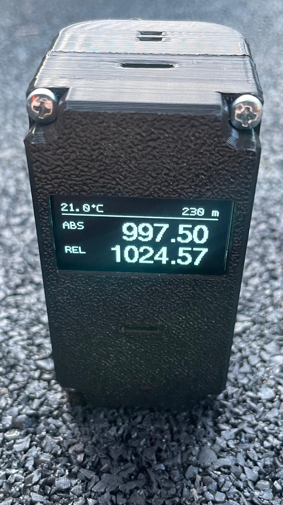

# Nano Barometer (Arduino Nano + BMP280 + SH1106)

A simple digital barometer for **Arduino Nano** that measures temperature and pressure using **BMP280** and displays values on a **128x64 OLED (SH1106)**.

## Features

- temperature and absolute pressure measurement
- relative pressure calculation (sea-level adjustment based on altitude)
- smoothed readings using a moving average (`FILTER_SIZE = 5`)
- altitude setting via button
- serial calibration offsets (temperature/pressure/altitude)
- settings saved to EEPROM
- sensor error detection + automatic reconnect attempts

Used libraries:
- `Wire`, `Adafruit_BMP280`, `U8g2lib`, `EEPROM`

## Hardware and wiring

- Arduino Nano
- BMP280 (I2C, address `0x76` or `0x77`)
- OLED SH1106 128x64 (I2C)
- button on pin `D3`

Wiring:
- **SDA** → A4 (Nano)
- **SCL** → A5 (Nano)
- button between **D3** and **GND**

## Button control

- short press: increases altitude by **5 m**
- long press (> 500 ms): auto-repeat, **100 m** step every 200 ms
- altitude range: **0–5000 m**, wraps to 0 on overflow

## Serial commands (9600 baud)

Send a command terminated with Enter (`\n`):

- `C` or `.` – prints current calibration (`T`, `P`, `A`)
- `T<value>` – sets temperature offset (range `-50` to `50`)
- `P<value>` – sets pressure offset in hPa (range `-100` to `100`)
- `A<value>` – sets altitude in meters (range `0` to `5000`)

Examples: `T-1.3`, `P2.4`, `A285`

***

